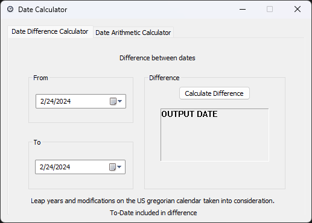

# Date Calculator
A calculator toolset for finding the difference between two dates and performing arithmetic operations on dates.

## What is taken into consideration when calculating:
- Calculator follows US gregorian calendar
- Days removed from September of 1752
- Leap years
- Difference minimum year is 1601
- Arithmetic minimum year is 0

## Build Instructions:
_Requires the following:_
- Visual Studio Community 2022
  - C++ MFC Build Tools v143
  - MSVC

1. Launch .sln Project file
2. Build for x64
3. Run program and enjoy!

## Program GUI:

